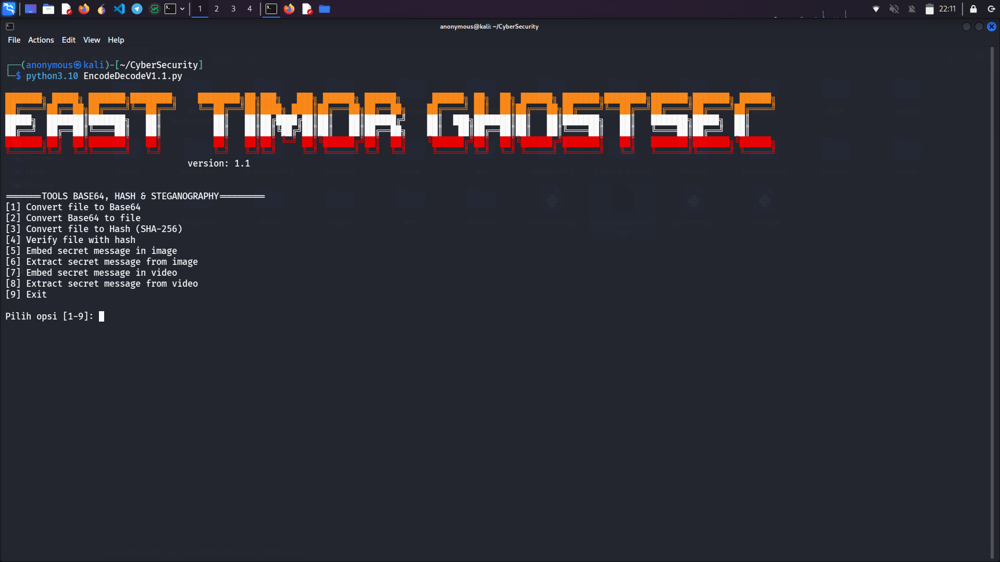

🔐 EncodeDecode Toolkit v1.1

A Swiss Army Knife for Data Encoding, Hashing, and Steganography

🌟 Features

   🔢 Base64 Encoding/Decoding
    
   Convert files ↔ Base64 text seamlessly.

   🖇️ SHA-256 File Hashing
     
   Generate and verify file integrity checksums.
   
   🖼️ Image Steganography (LSB)
   
   Hide/retrieve secret messages in PNGs (Lossless).
   
   🎥 Video Steganography (FFmpeg + OCR)
      
   Embed text in videos or extract it using Tesseract OCR.

⚙ Requirements

        pip install -r requirements.txt

🐧Linux (Ubuntu, Debian, Kali,)
        
        sudo apt update && sudo apt install tesseract-ocr
        sudo apt install ffmpeg
        sudo apt install fonts-dejavu
   
 🐧Linux (Arch)
 
        sudo pacman -S tesseract-ocr
        sudo pacman -S ffmpeg
        sudo apt install fonts-dejavu
   
  🍏 macOS
      
      /bin/bash -c "$(curl -fsSL https://raw.githubusercontent.com/Homebrew/install/HEAD/install.sh)"
      brew install tesseract
      brew install ffmpeg
      pip install opencv-python numpy pytesseract stegano
 
 🐍 Python Library

      pip install opencv-python numpy pytesseract stegano

 🚀 Instalation

     git clone https://github.com/EastTimorGhostSecurity/EncodeDecode.git
     cd EncodeDecode
     python or python3 EncodeDecodeV1.1.py

 📱 For Termux (Android)
     
     pkg update && pkg upgrade
     pkg install python
     pkg install tesseract
     pkg install ffmpeg
     pip install opencv-python numpy pytesseract stegano
